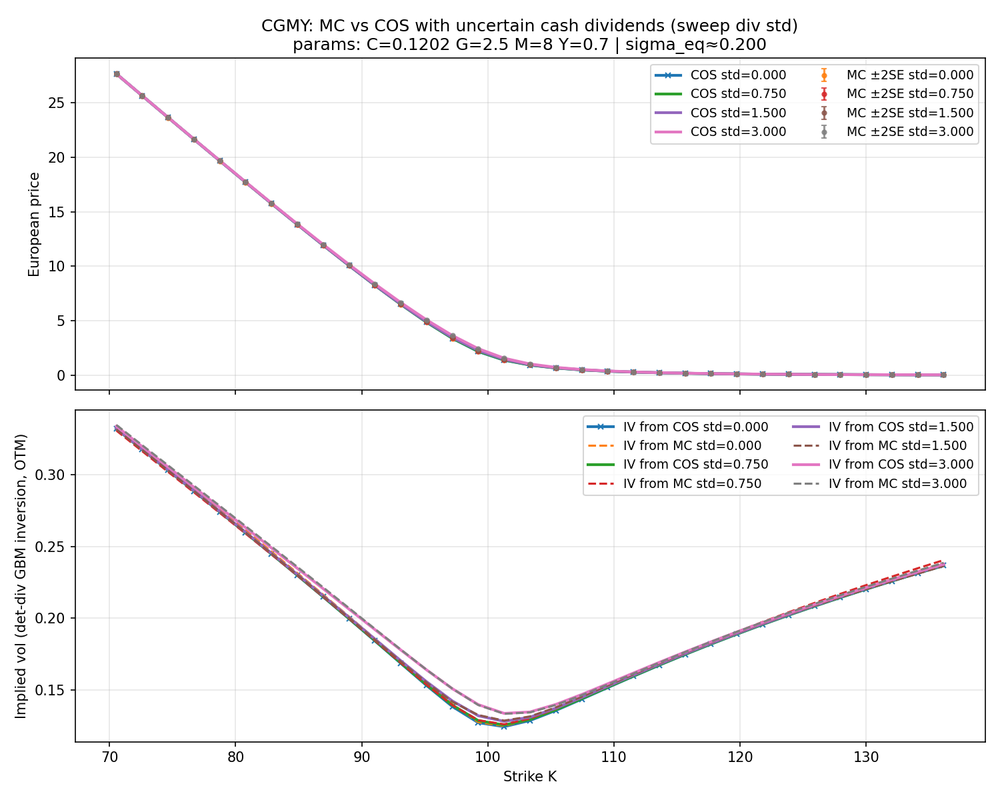
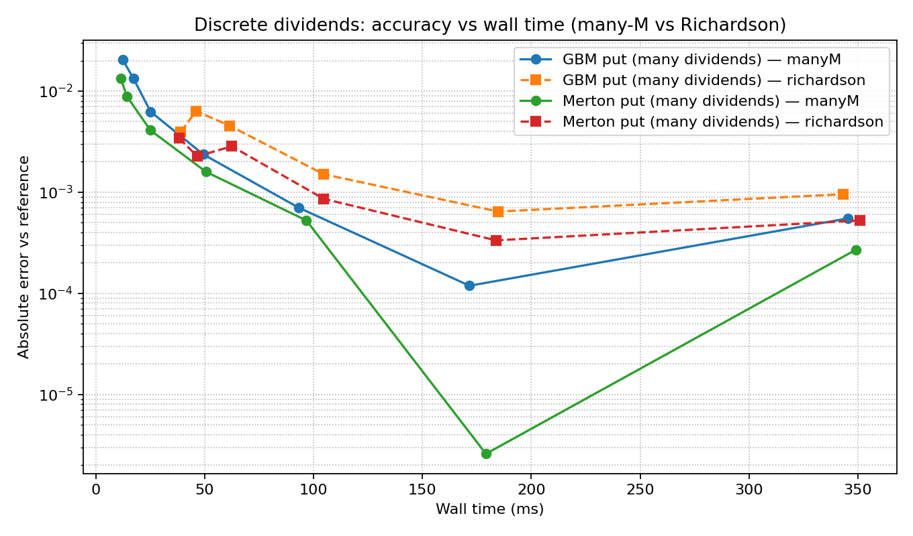
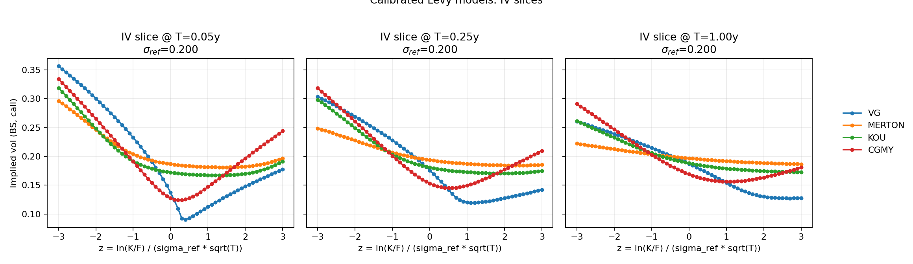

# Figures and Outputs

This repo generates most of its diagnostics into [figs/](figs/).

## Quick view

If you just want to refresh everything:

- Run the main diagnostics: `python plot_diagnostics.py`
- Run COS-vs-FDM profiling: `python tools/profile_cos_vs_fdm_time_complexity.py`
- Run Lévy skew persistence analysis: `python tools/analyze_skew_persistence.py`
- Run event IV surface plots:
  - Static: `python tools/plot_event_iv_surfaces.py`
  - Interactive (linked 3D): `python tools/make_linked_event_iv_surfaces.py --model vg` (or `--model merton`)

## Key modeling features

- **Dividend uncertainty**: All uncertain cash dividends are modeled using an inverse Gaussian (IG) process, preserving positivity while allowing intuitive cash-space mean/stdev specification.
- **CGMY skew persistence**: CGMY's asymmetric tempering (G < M) produces the most persistent skew and smile across maturities, especially on the call wing, making it ideal for mixing short-dated and long-dated calibrations.

## Static PNG figures

### COS / dividends / American diagnostics (from [plot_diagnostics.py](plot_diagnostics.py))

- COS vs Black–Scholes sanity check: [figs/cos_vs_bs_gbm.png](figs/cos_vs_bs_gbm.png)

  

  What it shows: European call prices under GBM with no dividends, COS vs the analytic Black–Scholes price (plus the residual).

- American rollback: hard max vs softmax: [figs/american_hard_vs_soft.png](figs/american_hard_vs_soft.png)

  

  What it shows: the continuation/intrinsic comparison under two rollback variants (hard max vs softmax smoothing).

- Lévy models vs equivalent GBM proxy: [figs/levy_vs_equiv_gbm.png](figs/levy_vs_equiv_gbm.png)

  

  What it shows: European prices under jump/Lévy models (Merton/Kou/VG) compared against a variance-matched GBM proxy.

- Dividend continuation (European vs American continuation at $t=0$): [figs/american_dividend_continuation.png](figs/american_dividend_continuation.png)

  

  What it shows: how the dividend-aware continuation behaves at time 0, comparing European vs American continuation components.

- Through-time comparison (COS European/American vs FDM): [figs/american_through_time.png](figs/american_through_time.png)

  

  What it shows: a through-time snapshot of values/continuation for COS (European + American rollback) alongside an FDM reference.

- Continuation value through time (with CSV):
  - Plot: [figs/continuation_through_time.png](figs/continuation_through_time.png)
  - Data: [figs/continuation_through_time.csv](figs/continuation_through_time.csv)

  

  What it shows: a time series view of the continuation value (and related quantities) that can be used for debugging rollback behavior.

- Forward / parity through time (with CSV):
  - Plot: [figs/forward_parity_through_time.png](figs/forward_parity_through_time.png)
  - Data: [figs/forward_parity_through_time.csv](figs/forward_parity_through_time.csv)

  

  What it shows: forward/parity consistency checks over time in the presence of discrete dividends.

- Dividend uncertainty: CGMY COS vs Monte Carlo (with CSV):
  - Plot: [figs/cgmy_mc_vs_cos_div_uncertainty.png](figs/cgmy_mc_vs_cos_div_uncertainty.png)
  - Data: [figs/cgmy_mc_vs_cos_div_uncertainty.csv](figs/cgmy_mc_vs_cos_div_uncertainty.csv)

  

  What it shows: compares COS pricing against a CGMY Monte Carlo cross-check under uncertain cash dividends (modeled via inverse Gaussian). Uses equity-like CGMY parameterization (G=2.5, M=8.0, Y=0.7) with negative skew. Dividend scenarios: $2.0 mean with stdev sweep ($0.00, $0.75, $1.50, $3.00). Validates that COS and MC agree under the IG dividend factor model across all uncertainty levels.

- Richardson extrapolation for discrete dividends (with CSV):
  - Plot: [figs/richardson_vs_manyM_discrete_divs.png](figs/richardson_vs_manyM_discrete_divs.png)
  - Data: [figs/richardson_vs_manyM_discrete_divs.csv](figs/richardson_vs_manyM_discrete_divs.csv)

  

  What it shows: compares Richardson extrapolation convergence against brute-force refinement (many timesteps) for American options with discrete dividends under GBM.

### COS vs FDM time/accuracy tradeoff (from [tools/profile_cos_vs_fdm_time_complexity.py](tools/profile_cos_vs_fdm_time_complexity.py))

- COS vs FDM scalability: [figs/cos_vs_fdm_time_complexity.png](figs/cos_vs_fdm_time_complexity.png)

  

  What it shows: for both European and American cases, compares runtime vs error for COS (sweeping $N$) and FDM (sweeping grid sizes).

### Lévy model skew persistence and calibration (from [tools/analyze_skew_persistence.py](tools/analyze_skew_persistence.py))

- Skew and curvature persistence after hybrid calibration:
  - Plot: [figs/skew_persistence_skew_curv_calib_cumulants_from_avgshape_T025_hybrid.png](figs/skew_persistence_skew_curv_calib_cumulants_from_avgshape_T025_hybrid.png)
  - Data: [figs/skew_persistence_by_model_calib_cumulants_from_avgshape_T025_hybrid.csv](figs/skew_persistence_by_model_calib_cumulants_from_avgshape_T025_hybrid.csv)

  

  What it shows: after matching VG/Merton/Kou/CGMY models at T=0.25 using a hybrid objective (cumulants + IV-slice penalty), compares how ATM skew and curvature evolve across maturities (0.05Y to 1Y). VG shows the sharpest/most extreme smile decay; Kou and Merton are similar and moderate; CGMY sits in between but with the most persistent smile across maturities, especially on the call wing.

- Calibrated IV slices (z-normalized moneyness):
  - Plot: [figs/iv_slices_calib_cumulants_from_avgshape_T025_hybrid_z_T005_T025_T100.png](figs/iv_slices_calib_cumulants_from_avgshape_T025_hybrid_z_T005_T025_T100.png)

  

  What it shows: implied vol slices at T=0.05, T=0.25, T=1.0 for the hybrid-calibrated models, plotted vs normalized moneyness z = ln(K/F)/(σ√T). Shows how each model's smile shape evolves with maturity after ensuring fair starting conditions at T=0.25.

- Calibration parameter outputs:
  - Hybrid calibration: [figs/calib_params_cumulants_from_avgshape_T025_hybrid.json](figs/calib_params_cumulants_from_avgshape_T025_hybrid.json)
  - Other variants available in `figs/calib_params_*.json`

### Event implied-vol surfaces (static)

- Event IV surfaces (GBM+event vs VG+event): [figs/event_iv_surfaces_gbm_vs_vg.png](figs/event_iv_surfaces_gbm_vs_vg.png)

  

  Generated by: [tools/plot_event_iv_surfaces.py](tools/plot_event_iv_surfaces.py)

## Interactive HTML figures (Plotly)

These are real interactive Plotly plots (pan/zoom/rotate), not images:

- Linked 3D surfaces (GBM vs VG): [figs/event_iv_surfaces_gbm_vs_vg_linked_3d.html](figs/event_iv_surfaces_gbm_vs_vg_linked_3d.html)
- Linked 3D surfaces (GBM vs Merton): [figs/event_iv_surfaces_gbm_vs_merton_linked_3d.html](figs/event_iv_surfaces_gbm_vs_merton_linked_3d.html)
- Linked 3D surfaces (GBM vs Kou+VG composite): [figs/event_iv_surfaces_gbm_vs_kouvg_linked_3d.html](figs/event_iv_surfaces_gbm_vs_kouvg_linked_3d.html)

Generated by: [tools/make_linked_event_iv_surfaces.py](tools/make_linked_event_iv_surfaces.py)

**Recommended**: The VG and CGMY models show the most persistent and realistic equity-like skew/smile behavior. The Kou+VG composite blends finite-activity and infinite-activity jump components for intermediate characteristics.

### How to open HTML interactives

GitHub (and VS Code’s default text editor view) will often show you the HTML source.
To view it as an interactive plot, use one of these:

1) Local browser (recommended)

- Start a local server from the repo root:
  - `python -m http.server 8000`
- Then open (example):
  - `http://localhost:8000/figs/event_iv_surfaces_gbm_vs_vg_linked_3d.html`

2) VS Code

- In the Explorer, right-click the `.html` file and choose “Open in Default Browser” (or “Open With…” if prompted).

3) From a GitHub link (if you want click-to-preview)

- Use an HTML preview proxy such as https://htmlpreview.github.io/ (paste the GitHub URL to the HTML file)
  - Note: availability/CSP behavior can vary by browser.

## Notes

- Some dev environments create local copies like `figs/* - Copy.png`. These are not part of the tracked artifact set.
